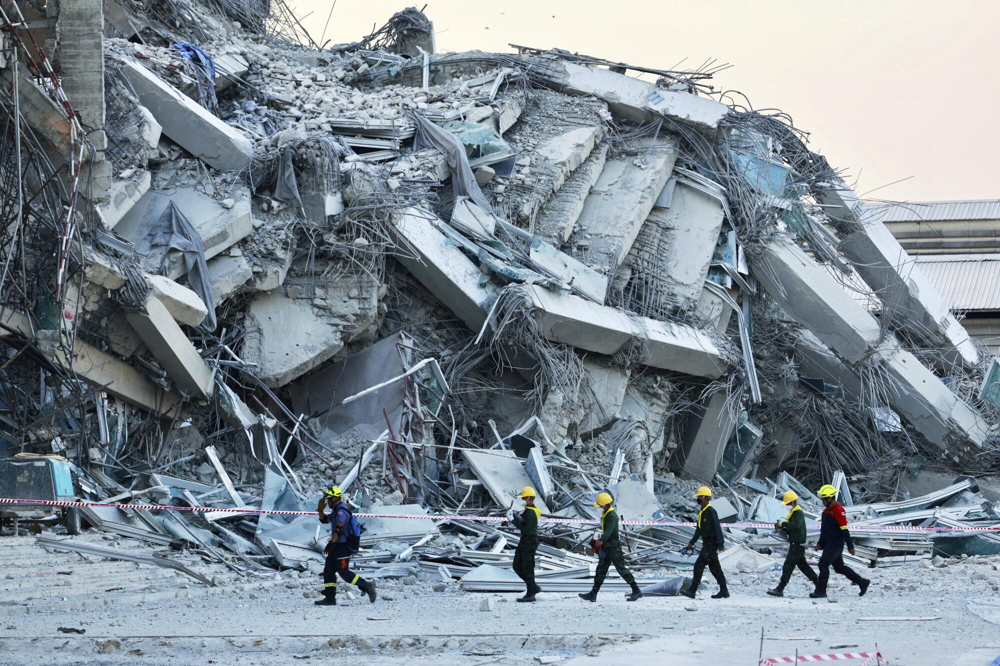

# Myanmar, Thailand Earthquake

## Overview
In late March 2025, a powerful 7.7 magnitude earthquake struck near Sagaing, Myanmar, followed shortly by another major quake affecting both Myanmar and Thailand. The twin disasters caused widespread destruction, thousands of casualties, and severe disruptions to infrastructure and basic services. Rescue efforts have been hindered by ongoing aftershocks and political obstacles, particularly in Myanmar, where the military-led government has limited outside aid, while Thailand has taken a more active role in relief. Remote areas remain difficult to reach, revealing critical gaps in earthquake preparedness. Compounding the crisis, cyberattacks have targeted emergency systems and spread misinformation, highlighting the need for both physical and digital resilience in disaster response.

In this simulation you will be tasked with coordinating a series of events. This simulation will have three phases:
1. Pre Earthquake
2. During Earthquake
3. Post Earthquake

### Description
During each of these phases, you will respond to a series of events that will pop up on the map. You will be tasked to handle each of these cases depending on your role in this simulation. Some migth require physical help, online help, infastructure rebuilding, etc. You will respond to these events by writing a detailed report explaining the location, who is involved, how they will help etc. These need to be extremely detailed so that someone that is not familiar with the simulation can understand how to respond to that specific event you are writing the report on.

Use the side bar on the left to naviagte the website. We encourage you to explore the webstie and get familiar where everyting is, so you can navigate it easily come the simulation.

Go to the Team -> Role Assignment page for more details about the roles available and details about them.

Below is a list of resources about the website.

- [GitHub Repository](https://github.com/future-of-security/simulation-template)
- [Markdown Examples](https://github.com/just-the-docs/just-the-docs/blob/main/docs/index-test.md) -> [Generated Page](https://just-the-docs.com/docs/index-test/)
- [GitHub Pages](https://pages.github.com/)
